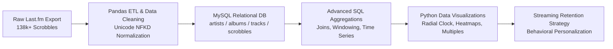
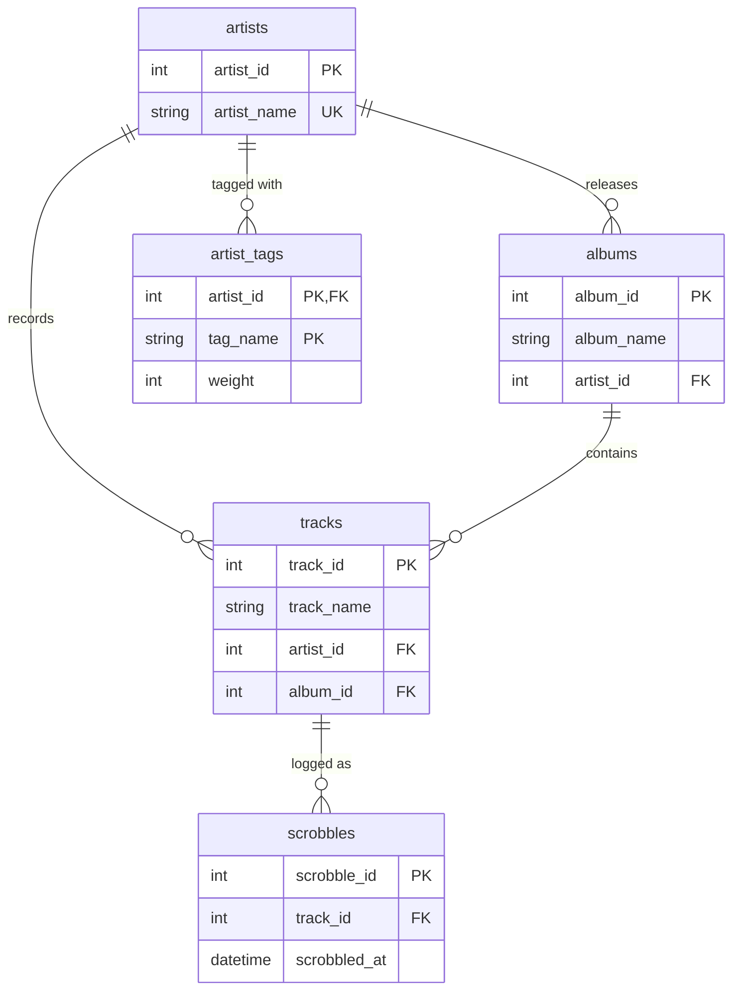

=======
# Spotify Listening History Analysis via Last.fm Scrobbles

An end-to-end data analytics and engineering project analyzing **138,000+ scrobbles** spanning over 5 years (2021–2026). The project extracts, cleans, and normalizes raw streaming logs into a 3NF MySQL relational database, performs targeted SQL analytical queries, visualizes long-term listening behavior, and translates behavioral data into **product retention and recommendation strategies for music streaming platforms**.

---

## 📌 Table of Contents
- [Architecture & Data Pipeline](#-architecture--data-pipeline)
- [Database Schema (3NF Normalization)](#-database-schema-3nf-normalization)
- [Key Analytical Insights](#-key-analytical-insights)
- [Product & Retention Strategy (Streaming Platform Applications)](#-product--retention-strategy-streaming-platform-applications)
- [Visualizations Gallery](#-visualizations-gallery)
- [Repository Structure](#-repository-structure)
- [Setup & Reproduction Guide](#-setup--reproduction-guide)

---

## 🛠️ Architecture & Data Pipeline

The project follows a standard production analytics workflow:



1. **Ingestion & Data Cleaning:** Deduplication, timestamp parsing, handling nulls, and stripping unicode accent discrepancies (e.g., `JAŸ-Z` vs. `JAY-Z`) using NFKD normalization.
2. **Relational Database Design:** Storing catalog entities into 3NF normalized tables with composite unique constraints and foreign keys to prevent data anomalies.
3. **SQL Analytics Engine:** Aggregating listening volumes, repeat behavior, diurnal patterns, and artist loyalty.
4. **Behavioral Synthesis:** Mapping user habits into algorithmic retention strategies for streaming platforms (e.g., Spotify, Apple Music).

---

## 🗄️ Database Schema (3NF Normalization)

The database schema (`lastfm_project`) is structured to eliminate redundant string storage across 138k+ scrobbles:



---

## 📊 Key Analytical Insights

* **Volume Surge & Habit Formation:** Annual listening exploded from **22,245 scrobbles (2021)** to an all-time peak of **108,114 (2023)** — a **+386% increase**, maintaining ~107k in 2024 (~293 tracks/day) before stabilizing.
* **The "Comfort Looper" Profile:** Repeat listen rate jumped from **76.7% in 2021** to **90.3% in 2022** and peaked at **93.6% in 2024**. More than 9 out of 10 tracks played are familiar tracks rather than novel discoveries.
* **Diurnal Peak (5:00 PM):** Peak activity occurs at **17:00 (36,968 plays)**, anchored within a broad daytime listening plateau from **10:00 AM to 6:00 PM** (background work/study listening).
* **Bimodal Seasonality:** Listening surges during **Spring (March–April: >79k combined)** and **Autumn (October–November: >73k combined)**, with a predictable annual trough in **September (26.4k total)**.
* **Weekday Shift:** Consumption transitioned from weekend leisure (2021–2022) to early-mid weekdays (Monday through Wednesday peaks in 2023–2025).
* **Catalog Concentration (Pareto Principle):** 
  * **1,162 artists** were "one-hit wonders" (played in only 1 calendar month).
  * **Only 613 artists** achieved multi-month loyalty ($\ge$12 months).
  * Top anchors (*Ariana Grande*, *Doja Cat*) were active in **100% of all 66 tracked months**.

---

## 🎯 Product & Retention Strategy (Streaming Platform Applications)

How music streaming platforms (Spotify, Apple Music, YouTube Music) can leverage these behavioral insights to **maximize Day-30/Day-90 user retention, reduce churn, and personalize UX**:

```
+--------------------------------------------------------------------------------------------------+
|                               STREAMING RETENTION PLAYBOOK                                       |
+------------------------------+----------------------------------+--------------------------------+
|      BEHAVIORAL SIGNAL       |          PRODUCT FEATURE         |       RETENTION MECHANISM      |
+------------------------------+----------------------------------+--------------------------------+
| Peak Hour: 17:00 (5:00 PM)   | Commute / Wind-down Notification | Daily Habit Hook               |
| 90–93% Repeat Listen Rate    | Prominent "On Repeat" & Loop UI  | Frictionless Comfort Listening |
| September Historical Dip     | Nostalgia / Anchor Artist Push   | Seasonal Churn Mitigation      |
| 1,162 One-Month Artists      | Familiarity-Anchored Discovery   | Safe Exploration Without Drop  |
+------------------------------+----------------------------------+--------------------------------+
```

### 1. Chrono-Targeted Re-Engagement (Right Time, Right Context)
* **The 17:00 Daily Habit Trigger:** The user has an established listening window at 5:00 PM (36.9k plays). Sending push notifications (e.g., *"Your evening mix is ready"*, *"Pick up where you left off"*) at **16:45–17:00** capitalizes on the user's natural transition from work/study into relaxation.
* **Q4 Campaign Timing:** Q4 (October–November) consistently displays the highest monthly intensity (~7.4k plays/month). Launching interactive recaps, early Wrapped teasers, or concert ticket notifications during October/November yields maximum engagement.

### 2. Seasonal Churn Mitigation (Navigating Historical Dips)
* **The September Drop Strategy:** September consistently marks the lowest volume of the year (26.4k scrobbles). During this vulnerable churn window, algorithmic recommendations should **NOT** introduce jarring or obscure genres.
* **Anchor Artist Injection:** Platforms should automatically curate "Homecoming Mixes" spotlighting the user's highest-loyalty bedrock artists (*Ariana Grande, Doja Cat, Travis Scott, Maggie Lindemann, Radiohead*) to revive passive listening with zero cognitive load.

### 3. Persona-Driven UI Personalization: "The Comfort Looper"
* **Primary UI Placement for Repeat Modes:** Because the user maintains a **~90–93% repeat listening rate**, the interface should adapt to a "Comfort Looper" persona:
  * Place **"On Repeat"**, **"Heavy Rotation"**, and custom loop/single-track repeat toggles directly on the Home tab rather than buried in menus.
  * Make auto-generated playlists lean into recent obsessions rather than broad weekly discovery.
* **Smart Repeat Queueing:** When a curated playlist ends, the auto-play algorithm should seamlessly continue with previously liked songs rather than new artist radio.

### 4. Guided Discovery (Low-Friction Music Exploration)
* **The "One-Hit Wonder" Guardrail:** Over 1,162 artists in the user's history were listened to in only 1 distinct month and subsequently abandoned.
* **Discovery Sandwich Strategy:** To expand catalog variety without causing drop-off, insert fresh artist recommendations between two verified loyal tracks (e.g., *Track A [Loyal]* $\rightarrow$ *Track B [New Discovery with matching audio features]* $\rightarrow$ *Track C [Loyal]*).

---

## 📈 Visualizations Gallery

| Analysis | Description | Preview |
| :--- | :--- | :--- |
| **Diurnal Polar Clock** | 24-hour radial distribution mapping peak listening hours. |  |
| **Year-over-Year Trend** | Total annual scrobble progression from 2021 to 2026. |  |
| **Repeat Listen Rate** | Percentage of annual scrobbles attributed to repeat plays. |  |
| **Day-of-Week Distribution** | Shift from weekend playback to mid-weekday listening. |  |
| **Listening Seasonality** | Heatmap matrix of listening volume by year and month. |  |
| **Top 10 Artist Trajectories** | Multi-year play trajectories of the top 10 most-played artists. |  |
| **Radiohead Obsession Curve** | Deep-dive tracking the explosive multi-year surge in Radiohead plays. |  |
| **Artist Loyalty Histogram** | Skewed distribution of one-month artists vs. lifelong staples. |  |

---

## 📂 Repository Structure

```
├── spotify_listening_history1.ipynb   # Main Jupyter notebook (ETL, SQL queries, visualizations, takeaways)
├── 1.sql                              # Database schema DDL (tables, keys, constraints, tag queries)
├── .env.example                       # Environment variable template for database credentials
├── .gitignore                         # Protects credentials (.env), checkpoints, and temp files
├── tags.csv                           # Aggregated artist genre tags and weights
├── *.png                              # Exported high-resolution analytical charts
└── README.md                          # Project documentation and retention strategy breakdown
```

---

## 🚀 Setup & Reproduction Guide

### Prerequisites
* Python 3.10+
* MySQL Server 8.0+

### 1. Clone & Install Dependencies
```bash
git clone https://github.com/nik0taa/spotify_listening_history1.git
cd spotify_listening_history1
pip install pandas sqlalchemy pymysql python-dotenv matplotlib numpy
```

### 2. Configure Environment Variables
Copy `.env.example` to `.env` and fill in your MySQL database credentials:
```bash
cp .env.example .env
```
Edit `.env`:
```ini
DB_USER=root
DB_PASSWORD=your_mysql_password
DB_HOST=localhost
DB_PORT=3306
DB_NAME=lastfm_project
```

### 3. Initialize Database
Execute `1.sql` in your MySQL client to construct the database schema and unique constraints:
```bash
mysql -u root -p < 1.sql
```

### 4. Run Notebook
Launch Jupyter and execute all cells in `spotify_listening_history1.ipynb`:
```bash
jupyter notebook spotify_listening_history1.ipynb
```

